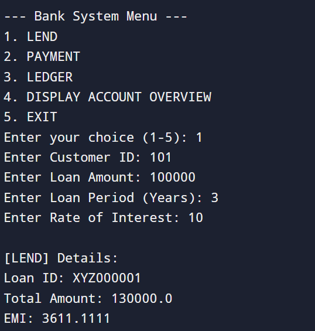
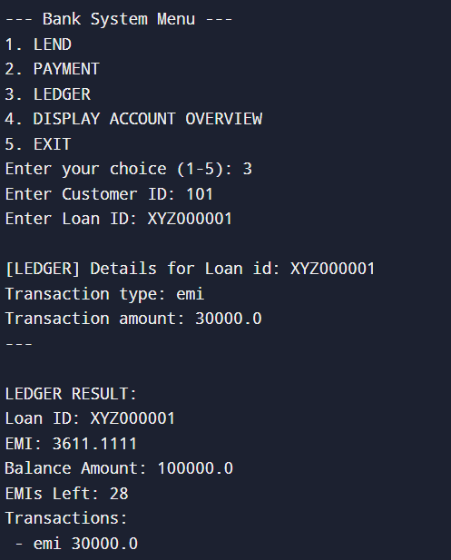
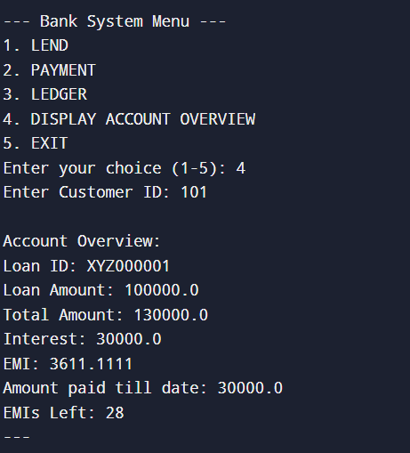

# 💰 Bank Loan Management System

A command-line based Python application that simulates a mini banking system for loan management. It allows lending loans to customers, processing EMI or lump sum payments, and tracking detailed ledgers and loan overviews.

---

## 🚀 Features

- **LEND**: Issue loans with any amount, duration, and interest rate.
- **PAYMENT**: Accept EMI or lump sum repayments. Automatically adjusts loan balance and remaining EMIs.
- **LEDGER**: View all transactions and track remaining balance and EMI count.
- **ACCOUNT OVERVIEW**: Summary of all loans per customer, including paid and remaining details.

---

## 🛠️ Tech Stack

- Language: **Python 3**
- Dependencies: **Standard Library Only**
- Interface: **Text-based Menu**

---

## 📷 Screenshots

### 🎯 Lend Money


### 💵 Make a Payment


### 📑 Loan Ledger


### 📊 Account Overview


> Place your screenshots in a folder named `screenshots/` inside the repo.

---

## 📋 How to Run

1. **Clone the Repository**  
   ```bash
   git clone https://github.com/yourusername/bank-loan-system.git
   cd bank-loan-system
